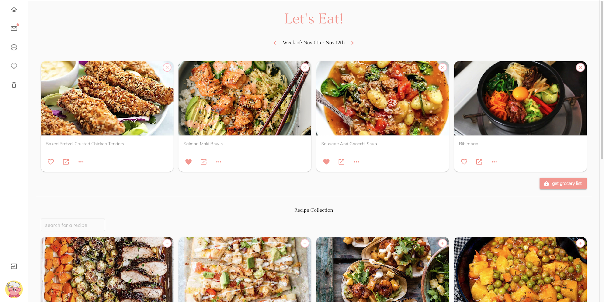
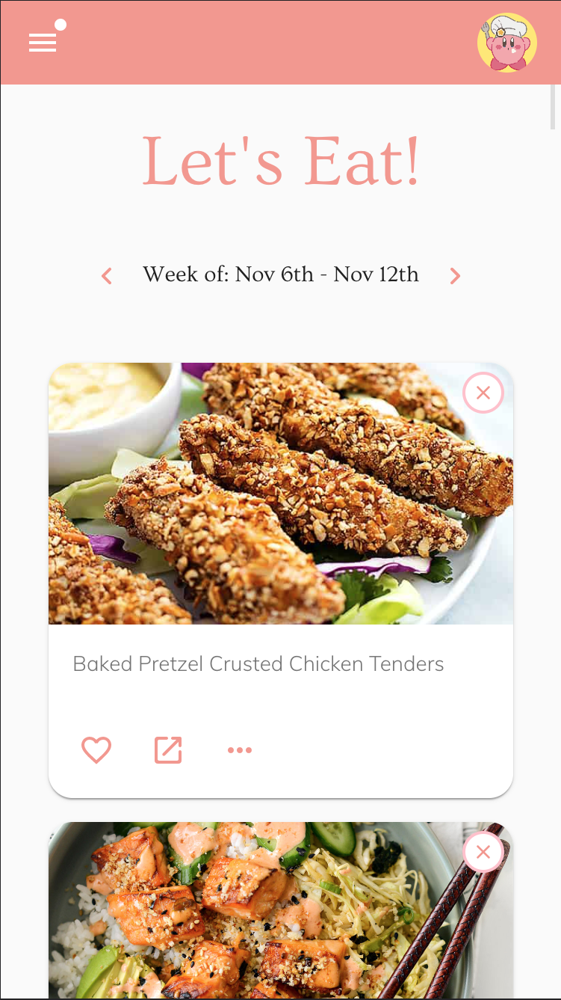

# Let's Eat

### A web app designed to help you and your partner plan what recipes to make and eat!

[Live Demo](https://lets-eat-together.onrender.com/)

For access to the demo, [contact me](https://kev-kev.github.io/portfolio)

Users can submit recipes to each other to be added to a shared collection. When a recipe is submitted, it's sent to your partner for them to approve or reject. Approved recipes get added to your collection, while rejected recipes are deleted.

Plan out what you'd like to make in advance using the weekly planner. Recipes from your collection can be added to (and removed from) the weekly section. After choosing what you'd like to cook for the week, users can generate a grocery list, which combines and consolidates ingredients from all your weekly recipes into one convenient list.

Made a mistake or ended up not liking that viral 5-minute recipe you added? Recipes can easily be edited or deleted from your recipe collection.

Let's Eat uses media queries and fluid grid breakpoints, so it's responsive on devices of all sizes.

Backend: Ruby on Rails API

Frontend: ReactJS

## 1. Install dependencies (optionally you can install [yarn](https://yarnpkg.com/)):

Navigate to the frontend folder in the cloned repo's directory.

Run:

`npm install`

or if you chose yarn, just run `yarn`

In another terminal, cd into the backend folder and run:

`bundle install`

## 2. Add env varibles:

Create a .env file in the project's root folder and add:

`REACT_APP_API_URL = your backend server address (default is http://localhost:4000)`

## 3. Run the app:

To start the backend server, open the backend folder and run:

`rails s`

In another terminal window, navigate to the frontend folder and run:

`npm start`

or if you are using yarn, run:

`yarn start`
