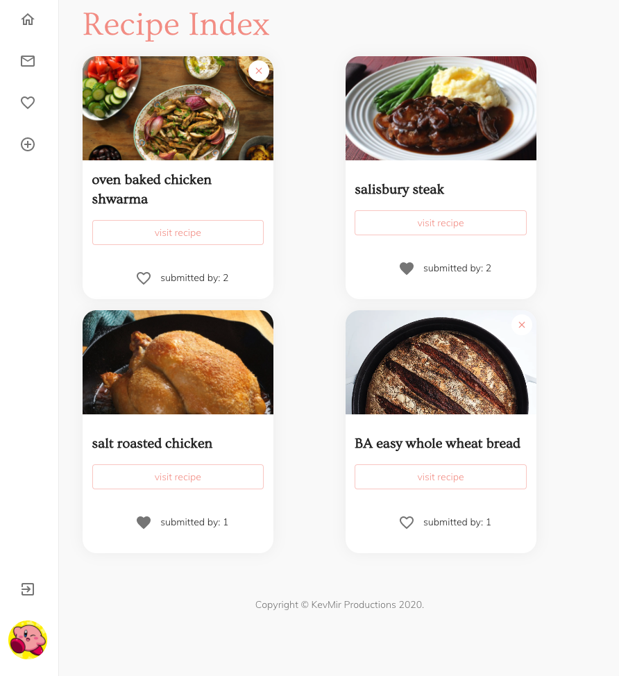

## Let's Eat

A web app to help you and your partner decide what recipes to make and eat!

Users can submit recipes to each other to be added to a shared recipe bank. When a recipe is submitted, it's sent to your partner for them to vote on. Approved recipes get added to your shared recipe bank, while rejected recipes are deleted.
End up not liking a recipe that you've added to your collection? Recipes can still be deleted from your recipe collection after they've been approved.

Walkthrough: https://bit.ly/3hJCjbX

Backend: Rails API

Frontend: React JS

## 1. Install dependencies (optionally you can install [yarn](https://yarnpkg.com/)):

Navigate to the frontend folder in the cloned repo's directory.

Run:

`npm install`

or if you chose yarn, just run `yarn`

In another terminal, cd into the backend folder and run:

`bundle install`

## 2. Add env varibles:

Create a .env file in the project's root folder and add:

`REACT_APP_API_URL = your backend server address (default is http://localhost:4000)`

## 3. Run the app:

To start the backend server, open the backend folder and run:

`rails s`

In another terminal window, navigate to the frontend folder and run:

`npm start`

or if you are using yarn, run:

`yarn start`
